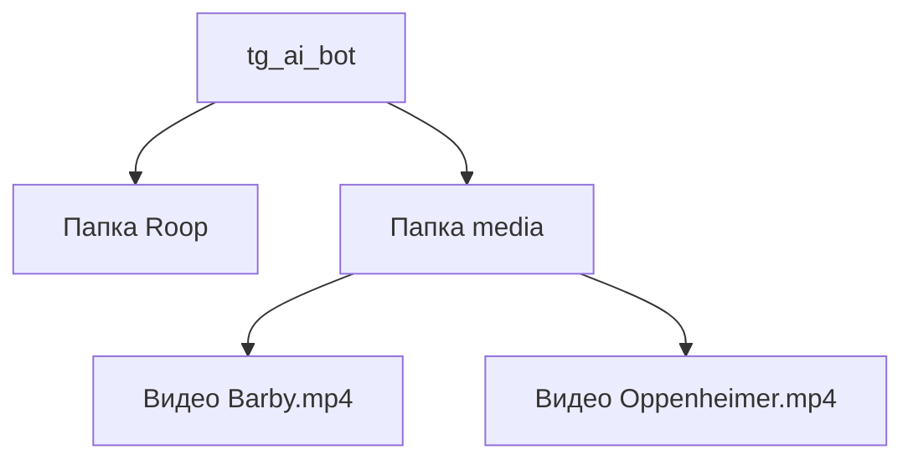

# Удаленный рендеринг видео через бота с использованием проекта Roop

Данный проект представляет собой скрипт на Python, который позволяет выполнять удаленный рендеринг видео через Telegram-бота с использованием проекта Roop. Скрипт взаимодействует с удаленным сервером, получает задания на рендеринг, загружает фото пользователя для рендеринга, производит рендеринг видео и отправляет готовое видео обратно пользователю.


<!-- ## Описание проекта -->

<!-- Проект использует Docker Compose для развертывания контейнеров со скриптом, MySQL, PHPMyAdmin и контейнерами для миграций. Основные настройки для разработки и продакшена находятся в файлах `docker-compose.yaml` и `docker-compose-production.yaml`. -->
## Установка Python 3.11 и Git Bash

Для начала работы с проектом, вам понадобятся Python 3.11 и Git Bash. Вот как их установить:

### Установка Git Bash

Для работы с репозиториями и контроля версий, установите Git Bash — удобный терминал для Git на Windows.

### Шаг 1: Скачивание установщика

1. Перейдите на официальный сайт Git по адресу: [https://git-scm.com/downloads](https://git-scm.com/downloads)

2. Нажмите на ссылку "Download for Windows" (Скачать для Windows), чтобы начать загрузку установщика.

### Шаг 2: Установка Git Bash

1. Запустите загруженный установщик Git Bash.

2. Выберите настройки установки:
   - Оставьте "Use Git from the Windows Command Prompt" (Использовать Git из командной строки Windows) выбранным.
   - Выберите "Checkout Windows-style, commit Unix-style line endings" (Выберите стиль Windows для проверки, стиль Unix для фиксации строк).

3. Продолжите установку, следуя инструкциям установщика.

### Шаг 3: Проверка установки

После завершения установки, вы можете проверить версию Git в Git Bash. Откройте Git Bash из меню Пуск или щелкнув правой кнопкой мыши в нужной папке и выбрав "Git Bash Here".

В терминале Git Bash, введите следующую команду:

```bash
git --version
```

### Установка Python 3.11

1. Перейдите на официальный сайт Python по адресу [python.org](https://www.python.org/downloads/).

2. Скачайте установщик Python 3.11 для вашей операционной системы.

3. Запустите установщик и следуйте инструкциям по установке Python. Убедитесь, что вы выбрали опцию "Add Python 3.11 to PATH" (Добавить Python 3.11 в PATH) во время установки.

4. После успешной установки, вы можете проверить версию Python в командной строке:

```bash
python --version
```

## Клонирование репозитория

Для клонирования репозитория [tg_ai_bot](https://github.com/ilkarataev/tg_ai_bot) выполните следующие шаги:

1. Откройте терминал (или командную строку) на вашем компьютере.

2. Перейдите в папку, где вы хотите разместить репозиторий:

```bash
cd /путь/к/папке
git clone https://github.com/ilkarataev/tg_ai_bot.git

```
3. Теперь репозиторий будет склонирован в выбранную вами папку. Вы можете перейти в папку tg_ai_bot и начать работу с проектом.

## Настройка клиента для рендеринга

1. Создайте папку `media` в корне репозитория и поместите в нее оригинальные видеоролики для рендеринга.
2. Скачайте с яндекса и распакуйте папку `Roop` Новый [Новый_от_23_08_2023](https://disk.yandex.ru/d/HSAz2m2LdWvQ-w) [Старый](https://disk.yandex.ru/d/8jcKLjyKzrLH7w) и поместите ее внутрь проекта.
3. Каталог должен выглядеть примерно так:

## Библиотеки и зависимости

Для установки необходимых зависимостей из файла `requirements.txt`, выполните следующую команду в вашем терминале:

```bash
pip install -r requirements.txt
```

## Запуск в консоли

Для запуска приложения в консоли с помощью команды `bash ./run_client.sh`, выполните следующие шаги:

1. Откройте терминал (командную строку) или текстовой редактор на вашем компьютере.

2. Перейдите в папку, где находится скрипт `run_client.sh`:

```bash
./run_client.sh
```

Также можно импортировать задачу в планировщик utils/Windows_scheduler_render.xml. Необходимо изменить путь до скрипта на 48 строке xml файла.

Добавлено автоматическое обновление клиента с сервера.

## Переменные окружения

Создайте файл `.env` для настройки переменных окружения. Пример настроек:  

IFACE=127.0.0.1 -интерфейс для проброса mysql порта  
PHP_ADMIN_PORT=88 - пхп админ порт для локальной разработки  
MYSQL_PORT_OUT=33069 - проброс порта mysql  
DATABASE_USERNAME=root  
DATABASE_PASSWORD= - пароль для доступа питона и mysql  
DATABASE_HOST=mysql -если работаем из докера хост mysq,если из вне то 127.0.0.1  
DATABASE_PORT=3306 -если работаем из докера порт 3306 mysq,если из вне то 33069  
DATABASE_NAME=ai_bot - имя базы данных для доступа питона и mysql
DATABASE_HOST_MIGRATIONS - имя хоста для миграций (при разработке проще использовать разные переменые), default: mysql
DATABASE_PORT_MIGRATIONS -тоже самое. default:3306
#PROD BOT  
BOT_TOKEN= -токен доступа к боту  
YANDEX_DISK_TOKEN - яндекс токен OAuth выдается на год  
PROD=False - True / False обозначение для логов, если True загружается анкету и фото на яндекс диск

YOOMONEY_SERVICE_PRICE=2 - цена за услугу на YOOMONEY.Валюта рубли
YOOMONEY_WALLET_TOKEN=  - токен YOOMONEY
YOOMONEY_RECEIVER= id получателя берется из лк YOOMONEY.
Статья по получению токена на [YOOMONEY](https://habr.com/ru/post/558924/)

## Develop
Для обновления списка пакетов в requirements.txt используем pipreqs ./project_path  
``` pipreqs ./ --force```

    Для загрузки в переменую окружения из .env можно использовать bash run.sh
     или
    #!/usr/bin/env bash
    set -a;source .env;set +a
    Для запуска бота без докера.  
Запускать в папке с файлами docker-compose.yaml

Запуск контейнеров в фоновом режиме без запуска бота для разработки  
```docker-compose up -d ```  
C опцией --build контейнеры пересоберутся  
```docker-compose up -d --build```  
Для удаления всех данных после изменения docker-compose  
``` docker-compose down -v --remove-orphans ```  
Для сборки продакшен docker-compose  
```docker-compose -f docker-compose-production.yaml up -d --build```
Посмотреть запущенные контейнеры
```docker ps```
### Запуск миграций  
Истинный файл миграций db_class.py в папке libs
Редактируем его, а затем автогенерируем миграции.
Доступ к базе через переменные среды.
DATABASE_HOST_MIGRATIONS
DATABASE_PORT_MIGRATIONS
Локально:
Запуск миграций  
```  alembic upgrade head ```  
Создание новой миграции    
``` alembic revision --autogenerate -m 'Name for migratiob' ```   
Запуск миграции в контейнере
``` docker-compose -p ai_bot_mysql up``` не доработанно  
 
### backend
Читаем таски берем одну и обрабатываем на клиенте.
Возвращает телеграм юзер айди  
Запросы могут быть не актуальным смотерть код  
``` curl http://localhost:5000/tg-ai-bot/rest/v1/get_task_to_render ```
Сохранение фото  
``` curl -X POST http://localhost:5000/tg-ai-bot/rest/v1/get_photo_to_render --output output_photo.jpg -H "Content-Type: application/json" -d '{"tg_user_id": 673623552}' ```  
Скачивание клиентского кода
``` curl -X GET http://localhost:5000/tg-ai-bot/rest/v1/get_client --output client.py -H "Content-Type: application/json" ```
Замена статуса   
``` curl -X POST http://localhost:5000/tg-ai-bot/rest/v1/set_status -H "Content-Type: application/json" -d '{"status": "ready_to_render", "tg_user_id": 673623552}' ```  
Нужно добавить будет столбец времени рендрина и высчитывать и записывать
На прод сделать запросу   
``` curl https://ilkarvet.ru/tg-ai-bot/rest/v1/get_task_to_render ```  

### client
При вызове клиента с аргументом --update  
Клиент будет обновлен и перезаписан версией из сервера.